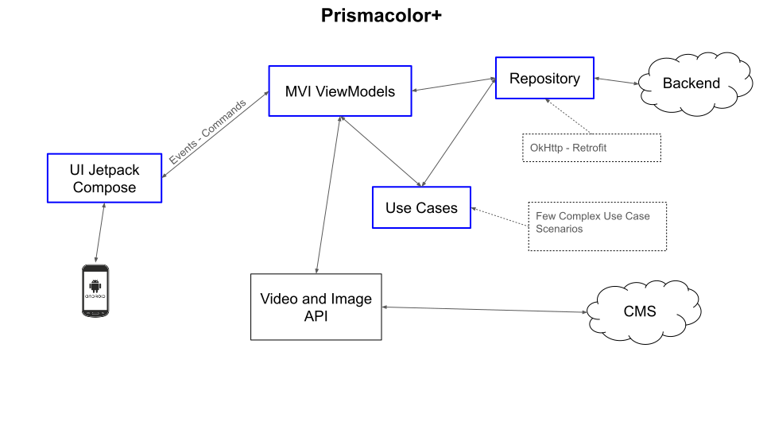
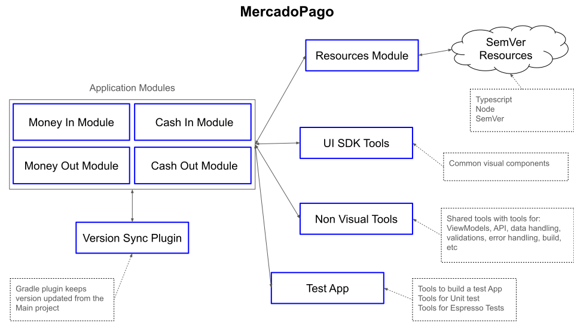
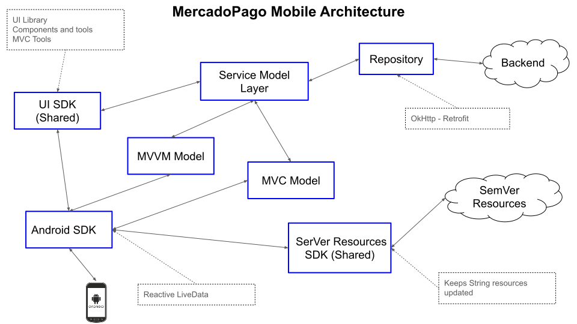
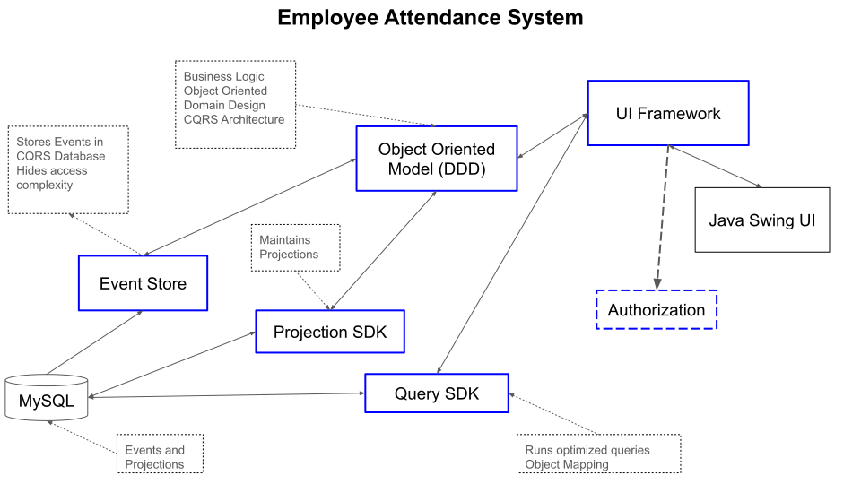
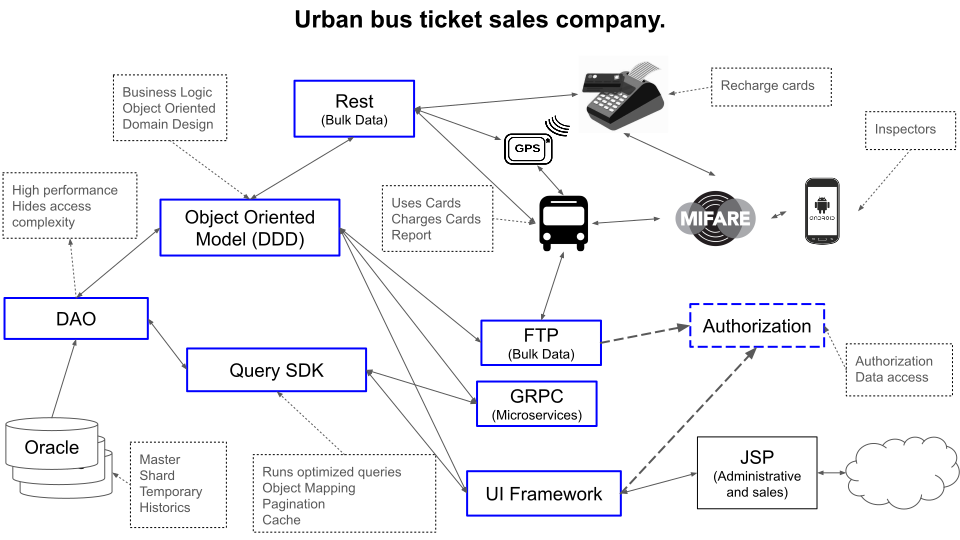

# Architectural diagrams

Blue boxes are stuff that I was directly involved in architecture.

---

### Prismacolor

- **Methodologies**: Agile.
- **Architecture**: Eventual MVI architecture.
- **Languages**: Kotlin.
- **Libraries**: Android SDK, Retrofit, Jetpack Compose, Koin.
- **Design Patterns**: MVI, Dependency Injection.
- **Tools**: Figma, Slack, Azure.

## Mercado Pago

### Microservices Backend

- **Architecture**: Microservices architecture, 3 layers of abstraction, MVC.
- **Languages**: JavaScript, TypeScript, GoLang.
- **Libraries**: Amazon AWS, MySQL, Object Storage, KWS, Apache Kafka.
- **Design Patterns**: Creational, Adapters, Strategy, Chain of Responsibility.
- **Tools**: Amazon AWS, Apache Kafka, MySQL.

### Mobile architecture

- **Architecture**: Event-driven architecture, MVC, MVVM.
- **Languages**: Kotlin.
- **Libraries**: AndroidX Test, Espresso, Jetpack, OkHttp, Retrofit, ktx extensions, LiveData, AndroidX, Picasso, MockWebServer, PlayServices, Firebase, Gson, Google Maps.
- **Design Patterns**: Creational Patterns, Observers, State, Strategy, Command, Adapter, IoC.
- **Tools**: Jira, Bugsnag, Google Suite, Zeplin, CircleCI, GitHub, DataDog, Trello, Slack, Kafka.

## Eventbrite

- **Architecture**: Fragment-based navigation, MVC, MVVM, Espresso, Robolectric.
- **Languages**: Java, Kotlin.
- **Libraries**: Jetpack, OkHttp, Retrofit, LiveData, Picasso, PlayServices, Firebase, Gson, AndroidX, PayPal Here, JUnit, Room, OrmLite, Analytics, Facebook Login.
- **Design Patterns**: Event-driven architecture using MVVM, MVC, Repository, DAO (API), Creational Patterns, Observers, State, Strategy, Command, Adapter, IoC.
- **Tools**: Jira, Bugsnag, Google Suite, Zeplin, GitHub, Slack, Jenkins.

## Cricyt

- **Architecture**: Object-oriented architecture, CQRS.
- **Languages**: Java.
- **Libraries**: Swing, PostgreSQL.
- **Design Patterns**: Event Sourcing, CQRS.
- **Tools**: Eclipse, PostgreSQL.

## Redbus

- **Architecture**: Object-oriented architecture, domain-driven design (DDD).
- **Languages**: Java, JSP, C++.
- **Libraries**: Spring, NFC, REST.
- **Design Patterns**: Singleton, Factory, Observer, Strategy.
- **Tools**: Jira, GitHub, Jenkins.

## Nuebus Backend

- **Architecture**: Object-oriented architecture, domain-driven design (DDD).
- **Languages**: Java, JSP.
- **Libraries**: Oracle.
- **Design Patterns**: MVC, DAO.
- **Tools**: Eclipse, Oracle.
