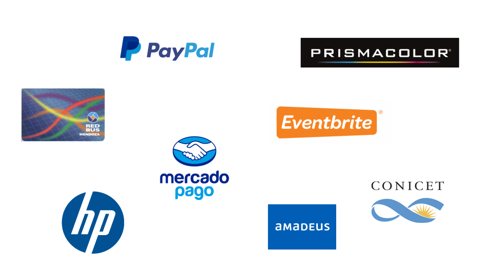
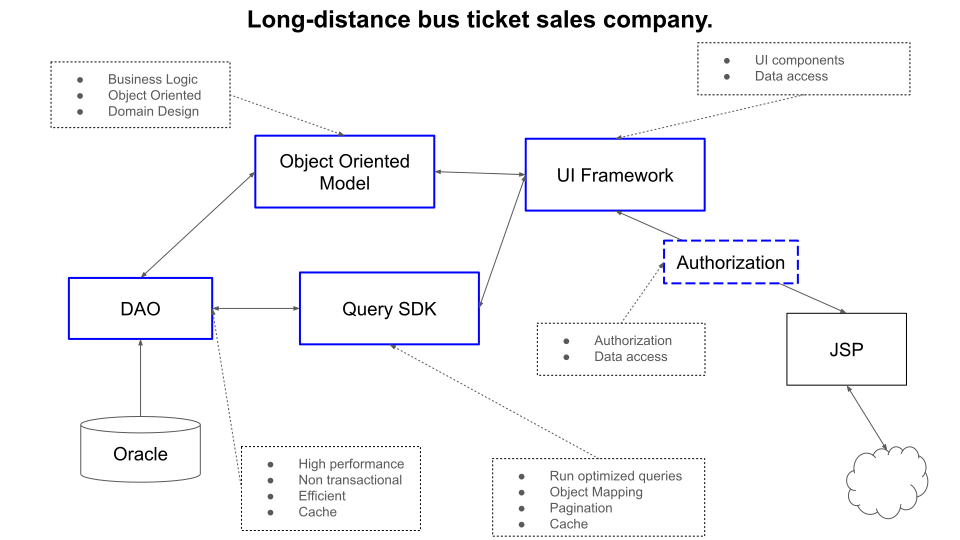

# Professional Quick Overview

## Dept Argentina

- **Principal II Android Developer**
- **Duration**: 08/2023 - 04/2024
- **Project**: Prismacolor+
- **Methodologies**: Agile.
- **Architecture**: Eventual MVI.
- **Languages**: Kotlin.
- **Libraries**: Android SDK, Retrofit, Jetpack Compose, Koin.
- **Design Patterns**: MVI, Dependency Injection.
- **Tools**: Figma, Slack, Azure.

## Mercado Pago

**Technical Leader**  
**Duration**: 05/2020 - 09/2021

### Backend

- **Project**: Money In - Money Out
- **Methodologies**: Agile.
- **Architecture**: Microservices, 3 layers of abstraction, MVC.
- **Languages**: JavaScript, TypeScript, GoLang.
- **Libraries**: Amazon AWS, MySQL, Object Storage, KWS, Apache Kafka.
- **Design Patterns**: Creational, Adapters, Strategy, Chain of Responsibility.
- **Tools**: Amazon AWS, Apache Kafka, MySQL.

### Android

- **Project**: Money In - Money Out - Cash In - Cash Out
- **Methodologies**: Agile, Waterfall.
- **Architecture**: Event-driven, MVC, MVVM.
- **Languages**: Kotlin.
- **Libraries**: AndroidX Test, Espresso, Jetpack, OkHttp, Retrofit, ktx extensions, LiveData, Picasso, MockWebServer, PlayServices, Firebase, Gson, Google Maps.
- **Design Patterns**: Creational, Observers, State, Strategy, Command, Adapter, IoC.
- **Tools**: Jira, Bugsnag, Google Suite, Zeplin, CircleCI, GitHub, DataDog, Trello, Slack, Kafka.

## Eventbrite

- **Senior Software Engineer II**
- **Duration**: 07/2016 - 05/2020
- **Project**: Organizer App
- **Architecture**: Fragment-based navigation, MVC, MVVM, Espresso, Robolectric.
- **Languages**: Java, Kotlin.
- **Libraries**: Jetpack, OkHttp, Retrofit, LiveData, Picasso, PlayServices, Firebase, Gson, AndroidX, PayPal Here, JUnit, Room, OrmLite, Analytics, Facebook Login.
- **Design Patterns**: Event-driven, MVVM, MVC, Repository, DAO (API), Creational, Observers, State, Strategy, Command, Adapter, IoC.
- **Tools**: Jira, Bugsnag, Google Suite, Zeplin, GitHub, Slack, Jenkins.
- **Methodologies**: Agile, Waterfall.

## Siemens - Atos Corp

- **Developer, Architect**
- **Duration**: 01/2004 - 05/2014
- **Project**: Redbus
- **Architecture**: Object-oriented, domain-driven design (DDD).
- **Languages**: Java, JSP, C++.
- **Libraries**: Spring, NFC, REST.
- **Design Patterns**: Singleton, Factory, Observer, Strategy.
- **Tools**: Jira, GitHub, Jenkins.
- **Methodologies**: Agile, Waterfall.

## Imaquio S.A.

- **Technical Leader & Developer**
- **Duration**: 01/2002 - 01/2007
- **Architecture**: Object-oriented architecture, domain-driven design (DDD). Service-oriented architecture (SOA).
- **Languages**: Java, JSP. EJB 2, Oracle, Web Services.
- **Libraries**: Oracle.
- **Design Patterns**: MVC, DAO.
- **Tools**: Eclipse, Oracle.
- **Methodologies**: Waterfall.

## CRICYT

- **Technical Leader & Developer**
- **Duration**: 05/2006 - 06/2007
- **Methodologies**: Waterfall.
- **Architecture**: Object-oriented architecture, CQRS.
- **Languages**: Java.
- **Libraries**: Swing, PostgreSQL.
- **Design Patterns**: Event Sourcing, CQRS.
- **Tools**: Eclipse, PostgreSQL.
