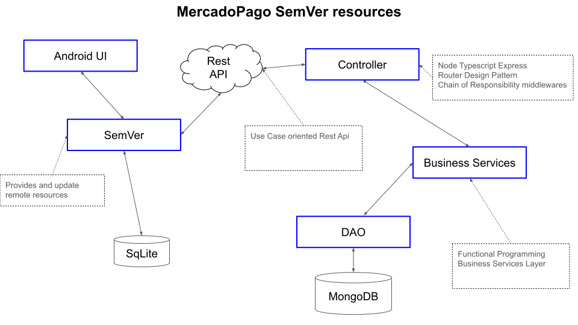

# Professional Quick Overview

- **30 years of experience** : Single apps (5) - Fullstack (18) - Backend only (8) - Android (12) - Microservices (3) - Teching Microservices ()
- **Programming Languages** : Clipper - Fox - Visual Fox - Java - Kotlin - Typescript
- **Architectures** : Single Apps - Client/Server - 3 Layered - SOA - Microservices

## NIT Company

- Object-oriented architecture.
- In house developed framework to access business models.
- Oracle DB
- WebServices

## NIT Company

- Java backend - SwiftUI front
- PostgreSQL database
- Object-oriented architecture, with DDD like focus
- Event Sourcing with CQRS.
- Data Projections and reduction.

## Siemens - Atos Corp

- Object-oriented, domain-driven design (DDD).
- SOA Architecture with 4 services. 1 of them was a monolith.
- Java, JSP, C++
- Spring, NFC, REST, gRPC
- Distributed Database
- Big data for some projections
- Data reduce from different sources
- Master/Shard and Historical DB schemas
- Late Consistency control.

## Mercado Pago

- Microservice, 3 layers of abstraction, MVC, RestAPI.
- TypeScript, Java.
- Api Gateways to do BFFE
- In house service mesh
- Amazon AWS, DynamoDB, Amazon Document DB, Apache Kafka.
- Grafana

### PayPal

- Apollo Server
- Splunk, DataDog

## National Technology University - Microservices Cathedra

- Domain Driven Design
- Sam Newman Microservice's book
- CQRS and Event Sourcing

- RabbitMQ, Rest
- Docker, Compose
- Java, Kotlin, Go, Typescript, Python
- Orchestration and Coreography

## My Coding Practices

### Kiss and YAGNI

I always try to keep things simple, but not forgetting GRASP Principles

- Readability
- Maintainability
- Code Elegance
- Simplicity
- Easy Refactoring

### Dry

Try to reuse the code when it represent the same business logic

- Single Responsibilities
- Unique Source or Truth
- Abstraction
- Reusability
- Encapsulation

### Continuous Refactoring

- Architecture updated
- Better code quality
- Mature over time
- Better change adoption
- Better test quality
- Sustainable code
